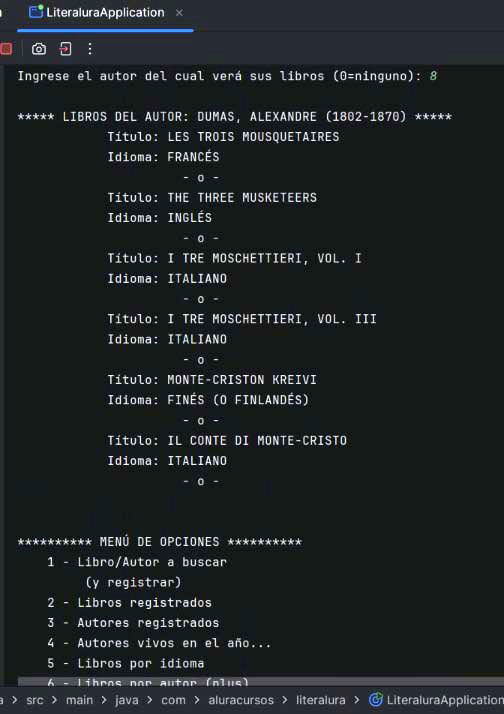
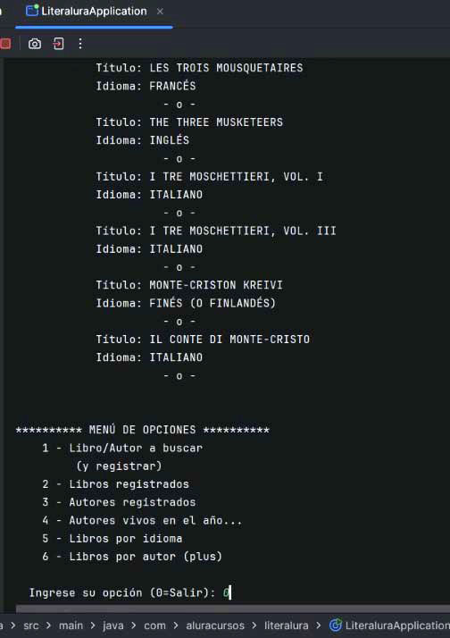

<!-- markdownlint-disable MD041 -->
<!-- markdownlint-disable MD033 -->
<!-- markdownlint-disable MD032 -->
<!-- markdownlint-disable MD022 -->

El desafío consiste en crear una aplicación usando los conocimientos recibidos hasta el momento en los cursos anteriores.
Dicha aplicación debe implementar el siguiente menú:

  

## Descripción de las funcionalidades a cumplir

* En la opción 1 (la más compleja a mi parecer) se solicita al usuario ingrese el nombre del libro (o autor) a buscar. Para satisfacer esa requitoria, la lógica de programación se divide en dos partes:

  * En la primera debemos conectarnos a la API Gutendex para obtener datos del libro/autor solicitado.
  * En la segunda deberemos conectarnos a una base de datos (PostgreSQL) para registrar esos datos.

* La opción 2 consulta la base de datos para mostrar, al usuario, lo solicitado: los libros que se registraron.
  
* La opción 3, del mismo modo, consulta la bases de datos para mostrar los autores que se registraron.

* La opción 4 solicita al usurario que ingrese un año para mostrar los autores (registrados) que estuvieron vivos en dicho año.

* La opción 5 lista los idiomas habilitados y solicita se ingrese un idioma para listar los libros registrados que están en es idioma.
  
En todas las opciones se debe realizar un control (mínimo) de que lo ingresado por el usuario es admisible por la aplicación.

Si bien la aplicación cumple con estas cinco funcionalidades que propuso el instructor Eric Monné Fraga de Olivera, y  que él califica de sencillas, he querido dar un pasito más. Atendiendo al constantemente incentivo de la instructora Génesys Rondón, agruegué una opción mas, que me costó, pero me deja más satisfecho.

* Opción 6. Lista los autores registrados y pide se elija uno para listar los libros de su autoría que estén en la bases de datos.

### Mejoras a la porpuesta inicial

La opción 1 registraba el primer libro que proveía la API Gutendex. Quise que el usuario (y yo mismo) tuviera más opciones. Por ello ahora se podrian mostrar todos los libros que devuelva la API, ordenados por los que tienen el mayor número de descargas. Por razones prácticas lo limité a solo doce; y el usuario tendrá la pobilidad de elegir cuál libro registrar o de no registrar ninguno.

En los listados de los libros, el idioma estaba dado por solo un código que un usuario puede desconocer. A fin de solucionar ese inconveniente se implementa la tabla idiomas (con 2 campos: id y detalle) que contiene los 184 idiomas de la norma ISO-639. Adjunto el script 'idiomasTablaISO639.sql' que deberá correrse al momento de crearse la base de datos (1). Esta mejora puede apreciarse claramente en la opción 5.

Agregé la opción 6 (un desafío personal) como ya mencioné anteriormente.

## Capturas y comentarios

En esta imagen se muestra como está estructurada la aplicación.
La clase inicial LiteraluraApplication en la raiz, tal como lo hace Spring Initializr.
Tomé como modalidad personal procurar que los nombres de los paquetes y las clases se limiten a cuatro letras, anteponiendo la inicial del tipo de clase.

* Opción 1 e ingreso de nombre del libro a buscar

* Opción 1 e ingreso de nombre del autor a buscar

* Opción 2

* Opción 3

* Opción 4 e ingreso del año

* Opción 5 e ingreso de opciones de idiomas diversos (nótese los títulos en japones y chino)

* Opción 6

* Opción 0 y salida de la aplicacíon

<!-- markdownlint-enable MD033 -->

* La aplicación se desarrollo en Java SE17, en el IDE IntelliJ.
  
* (1) Para hacer corre el script 'idiomasTablaISO639.sql', una vez creada la base de datos debe hacer clikDerecho sobre la misma y seleccionar 'Query Tool'. Desde allí, con Alt+o podrá abrir el script. Hágalo correr presionando F5 y se creará la tabla 'idioma' con los campos 'id' y 'detalle', y registrarán los 184 idiomas ISO-639.
Concluida la creación de la tabla, podrá ver en la aplicación los nombres completos de los idiomas.
